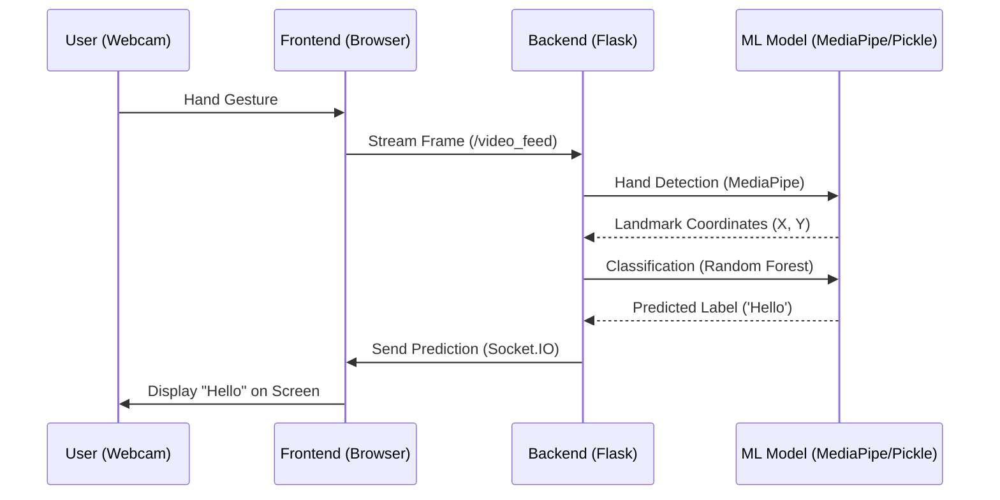

# 🎓 HandSignify: COMPLETE BACKEND MASTERY GUIDE 🚀

Welcome to your comprehensive guide to backend development, machine learning integration, and system architecture. This document uses **HandSignify**—your real-world project—as a living classroom to teach you everything from the absolute basics to advanced production engineering.

---

## 🗺️ Table of Contents
1.  [Backend Fundamentals (Beginner)](#1-backend-fundamentals)
2.  [Project Internal Workflow (Step-by-Step)](#2-project-internal-workflow)
3.  [Python Backend Deep Dive (Flask)](#3-python-backend-deep-dive)
4.  [Machine Learning Integration (MediaPipe)](#4-machine-learning-integration)
5.  [Line-by-Line Code Explanation](#5-line-by-line-code-explanation)
6.  [Dependencies & Ecosystem](#6-dependencies--ecosystem)
7.  [Architecture & Scaling (Intermediate)](#7-architecture--scaling)
8.  [Security Fundamentals](#8-security-fundamentals)
9.  [Database Design & Concepts](#9-database-design--concepts)
10. [Production & Deployment (Advanced)](#10-production--deployment)
11. [Performance Engineering](#11-performance-engineering)
12. [The Full Learning Roadmap](#12-the-full-learning-roadmap)

---

## 1️⃣ Backend Fundamentals
*Understanding the "Invisible" Engine*

### What is a Backend?
In HandSignify, the "Frontend" is what the user sees (the buttons, the camera feed, the logo). The **Backend** is everything else. It's the brain that lives on the server, processes your webcam frames, checks the database for users, and decides what sign corresponds to your hand movement.

### Core Concepts
*   **The Server**: Think of a server as a 24/7 computer waiting for "requests." In your project, your laptop acts as the server when you run `python app.py`.
*   **Request & Response**: 
    *   **Request**: "Hey Backend, here is a picture of my hand. What character is this?"
    *   **Response**: "Hey Frontend, that's the letter 'A'."
*   **HTTP (Hypertext Transfer Protocol)**: The language of the web. It defines *how* messages are formatted and sent.
*   **REST (Representational State Transfer)**: A set of "rules" for building APIs. For example, using `POST` to send data and `GET` to receive it.
*   **API (Application Programming Interface)**: The "waiter" in a restaurant. You (the frontend) give the waiter an order (the request), and the waiter brings it to the kitchen (the backend) and returns with your food (the response).
*   **Routing**: The map of your backend. When a user visits `/login`, the router sends them to the Login logic.
*   **Middleware**: "Security Guards." Before a request reaches your code, middleware might check if the user is logged in.
*   **JSON (JavaScript Object Notation)**: The format we use to trade data. It looks like a dictionary in Python: `{"character": "B"}`.
*   **Model Inference**: The act of giving a "trained model" (your `model.p`) new data (hand landmarks) and asking it for a prediction.

---

## 2️⃣ Project Internal Workflow
*The Journey of a Frame*

### Step-by-Step Flow
1.  **Browser**: User navigates to `HandSignify`.
2.  **Frontend**: The HTML/JS loads and asks for webcam permission.
3.  **Capture**: JS captures a frame from the webcam.
4.  **Transport**: The frame is sent to the backend via a `/video_feed` stream.
5.  **Landmark Extraction**: Python uses **MediaPipe** to find 21 points on your hand.
6.  **Inference**: Those 21 points are fed into the **Random Forest** model.
7.  **Prediction**: The model returns a label (e.g., index 0 = 'A').
8.  **Emission**: The backend sends this prediction back via **WebSockets (Socket.IO)** or renders it into the video stream.

### 📊 Flow Diagram


---

## 3️⃣ Python Backend Deep Dive
*Why Python? Why Flask?*

### Why Python?
Python is the "Language of AI." Most powerful libraries (MediaPipe, Scikit-learn, NumPy) are built for Python, making it the perfect bridge between a website and a machine learning model.

### Flask Internals
*   **`app.run()`**: This starts a local development server. It listens on a specific "Port" (like 5001) for incoming connections.
*   **Routing Decorators (`@app.route`)**: These tell Flask: "If someone asks for this URL, run this specific function."
*   **Request Context**: Flask uses a "global" `request` object that automatically contains data for the *current* user's request.
*   **Streaming Responses**: In `video_feed`, we use a **Generator Function** (`yield`). Instead of sending one big file, we send "chunks" (frames) continuously as they are processed.
*   **Threading**: Flask can handle multiple users by running each request in a separate "Thread." However, since video processing is heavy, one user can slow down another (a **bottleneck**).

---

## 4️⃣ Machine Learning Integration
*The Brain of HandSignify*

### MediaPipe & Feature Extraction
MediaPipe doesn't just "see" a hand; it parses it. It identifies **21 landmarks** (joints). We don't send the raw image to our classifier; we send the **relative distances** between these points. This is called **Feature Extraction**.

### Model Inference (The Random Forest)
We use a **Random Forest Classifier** (`model.p`). 
1.  **Training**: We showed it thousands of hands and told it "This is A, this is B."
2.  **Inference**: Now, we give it a new hand, and it asks itself: "Is this more like the 'A's I saw or the 'B's?"

### 🧮 Simple Math of Prediction
If $X$ represents the hand landmark coordinates:
$$ \text{Prediction} = f(X) $$
Where $f$ is our model. It calculates probabilities:
*   $P(\text{'A'}) = 0.85$
*   $P(\text{'B'}) = 0.05$
The model picks the highest probability ('A').

---

## 5️⃣ Code Structure Explained Line-by-Line

### `app.py`: The Command Center
*   **Lines 4-30**: Imports. We bring in Flask (web), MediaPipe (AI), and Pickle (the model drawer).
*   **`db = SQLAlchemy(app)`**: Connects your backend to a database (data storage).
*   **`generate_frames()`**:
    *   `cap = cv2.VideoCapture(0)`: Turns on your camera.
    *   `hands.process(frame_rgb)`: The moment MediaPipe looks at the image.
    *   `prediction = model.predict(...)`: The moment the AI makes a guess.
*   **`socketio.emit(...)`**: Pushes data to the frontend *immediately* without the frontend asking.

### `services/sign_service.py`: The Helper
*   **`SignLanguageService`**: A "Service Class" that manages different types of translation (AI vs. Skeletal Rendering).
*   **`_render_skeletal_speech`**: Pure Python logic that draws a hand frame-by-frame using `cv2.line`.

---

## 6️⃣ Dependencies & Versions
*The Toolkit*

### `requirements.txt` (Pinned for Stability)
```text
# Web Framework
Flask==3.0.2
flask-socketio==5.3.6
eventlet==0.33.3

# AI & Math
mediapipe==0.10.9
opencv-python==4.8.1.78
numpy==1.24.3
scikit-learn==1.3.0

# Security & DB
Flask-SQLAlchemy==3.1.1
Flask-Bcrypt==1.0.1
python-dotenv==1.0.0
```

*   **Why pin versions?** If MediaPipe updates to `1.0.0` and changes how `hands.process` works, your code might break. Pinning ensures it always works exactly as it does today.
*   **Virtual Environments (`.venv`)**: A "box" for your project. It prevents HandSignify from conflicting with other Python projects on your PC.

---

## 7️⃣ Backend Architecture (Intermediate)
*Thinking Like an Architect*

### Monolithic Architecture
HandSignify is a **Monolith**. Everything (Frontend delivery, AI, User Logic, Database) lives in one single application (`app.py`). 
*   **Pros**: Easy to build, easy to test, fast local speed.
*   **Cons**: Hard to scale. If 1,000,000 people use it, one CPU cannot handle all those video feeds.

### Real-Time Video Bottlenecks
Video is "heavy." Each frame is a lot of data. Processing 30 frames per second (FPS) takes significant CPU power. This is the main **Performance Bottleneck**.

---

## 8️⃣ Security Fundamentals
*Protecting the System*

*   **CORS (Cross-Origin Resource Sharing)**: Prevents other websites from "stealing" your API. You define who is allowed to talk to your backend.
*   **Password Hashing (Bcrypt)**: We *never* store passwords as text. We store a "hash" (a one-way scrambled string). Even if a hacker steals the database, they don't have the passwords.
*   **Rate Limiting**: Preventing someone from asking "What letter is this?" 10,000 times a second (which could crash the server).

---

## 9️⃣ Database Concepts
*Memory for the Web*

Currently, you use **SQLite**. It's a file on your disk.
*   **SQL (Structured Query Language)**: Used for organizing data into tables.
*   **Scaling to PostgreSQL**: In production, we'd use PostgreSQL (a separate, powerful server) to handle thousands of concurrent users.

### Schema Example for HandSignify
| UserID | Username | Password_Hash | Created_At |
| :--- | :--- | :--- | :--- |
| 1 | Sarvesh | `$2b$12$...` | 2024-03-03 |

---

## 🔟 Production & Deployment (Advanced)
*How to Go Global*

1.  **WSGI (Gunicorn/Waitress)**: The "Industrial Strength" server. Flask's built-in server is for testing; Gunicorn is for the real world.
2.  **Docker**: Wrapping your project in a "container" so it runs exactly the same on your laptop, a Linux server, or "The Cloud."
3.  **CI/CD**: "Continuous Integration." Automatically runs tests and deploys your code every time you push to GitHub.

---

## 1️⃣1️⃣ Performance Engineering
*Speed is Key*

*   **Latency**: The time between you making a sign and the text appearing. We optimize this by resizing frames before processing.
*   **Throughput**: How many signs can we process per minute?
*   **GPU Acceleration**: Moving MediaPipe processing from the CPU to the Graphics Card (GPU) can make it 10x faster.

---

## 12️⃣ Full Learning Roadmap

### Phase 1: Python Mastery
*   Study Object-Oriented Programming (Classes).
*   Master Async loops (how to handle many tasks at once).

### Phase 2: Professional Backend
*   Learn **FastAPI** (The modern successor to Flask for AI APIs).
*   Deep dive into **PostgreSQL** and **Redis** (for caching).

### Phase 3: System Design
*   How to build **Microservices** (Splitting AI from Web).
*   Cloud Infrastructure (AWS/Azure).

---

**This is just the beginning. Your code is the foundation. Keep building!** 🛠️
